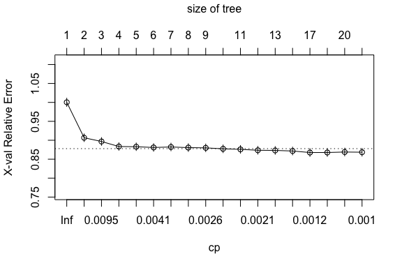
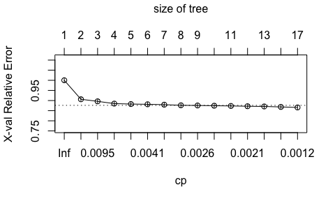
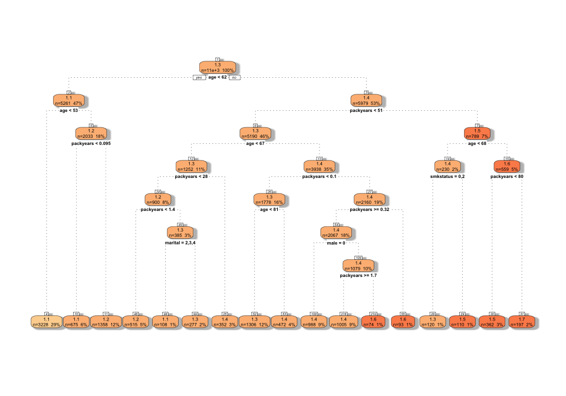

MetBiost\_HW2
================
Shengjun You
4/23/2022

-   [Part I: Prediction models for having a major smoking caused
    disease](#part-i-prediction-models-for-having-a-major-smoking-caused-disease)
    -   [Problem 1.](#problem-1)
    -   [Problem 2.](#problem-2)
    -   [Problem 3.](#problem-3)

# Part I: Prediction models for having a major smoking caused disease

## Problem 1.

``` r
load(here("data", "nmes.rdata"))
nmes[nmes == "."] <- NA
nmes <- mutate(nmes, mscd = ifelse((lc5==1)|(chd5==1), 1, 0))
```

Create variable **smkstatus** to distinguish people who never smoked,
former smokers and current smokers:

``` r
nmes <- mutate(nmes, smkstatus = case_when(
  eversmk==0 ~ 0, #0 stands for never smoked
  (eversmk==1) & (current==0) ~ 1, #1 stands for former smokers
  (eversmk==1) & (current==1) ~ 2 #2 stands for current smokers
  ))
```

Select a subset of features as predictors for statistical prediction
models:

``` r
d <- data.frame(
  mscd = factor(nmes$mscd),
  age = nmes$lastage,
  male = factor(nmes$male),
  smkstatus = factor(nmes$smkstatus),
  packyears = as.numeric(nmes$packyears),
  marital = factor(nmes$marital)
)
```

``` r
set.seed(1234)

if(!file.exists(here("data", "imp_d.RData"))){
  imp.d <- rfImpute(x = d[,2:6], y =d[,1])
  save(imp.d, file = "imp_d.RData")
} else{
  load(here("data", "imp_d.RData"))
  imp.d <- rename(imp.d, mscd = `d[, 1]`)
}
```

``` r
summary(imp.d)
```

    ##  mscd           age       male     smkstatus   packyears      marital 
    ##  0:12041   Min.   :40.0   0:7760   0:6555    Min.   :  0.00   1:8869  
    ##  1: 1607   1st Qu.:49.0   1:5888   1:3765    1st Qu.:  0.00   2:2557  
    ##            Median :61.0            2:3328    Median :  3.86   3:1205  
    ##            Mean   :60.6                      Mean   : 17.00   4: 355  
    ##            3rd Qu.:71.0                      3rd Qu.: 28.00   5: 662  
    ##            Max.   :94.0                      Max.   :216.00

``` r
table(MSCD = imp.d$mscd, Smoking_Status = imp.d$smkstatus)
```

    ##     Smoking_Status
    ## MSCD    0    1    2
    ##    0 5898 3126 3017
    ##    1  657  639  311

Among the 13648 people in the imputed data set, 1607 of them have major
smoking-caused disease(MSCD) and 12041 of them don’t. Among people who
don’t have MSCD, 5898 of them never smoked, 3126 are former smokers, and
3017 are current smokers. Among people who have MSCD, 657 of them never
smoked, 639 are former smokers, and 311 are current smokers.

## Problem 2.

``` r
set.seed(1234)
# Create indicators for the cases and controls
orig0 <- which(d$mscd == 0)
orig1 <- which(d$mscd == 1)

# Create an upweighted sample of cases
orig1up <- sample(orig1, ceiling(length(orig1)*2.5), replace = TRUE)

# Create a new upweighted dataset
updat <- rbind(imp.d[orig0, ], imp.d[orig1up, ])
```

``` r
set.seed(1234)
# From the new upweighted dataset, create a training and validation sample
controls <- which(updat$mscd == 0)
cases <- which(updat$mscd == 1)
train0 <- sample(controls, floor(length(controls)*0.7))
train1 <- sample(cases, floor(length(cases)*0.7))

# Name the training and validation samples
d.train <- rbind(updat[train0, ], updat[train1, ])
d.test <- rbind(updat[-train0, ], updat[-train1, ])
```

## Problem 3.

``` r
set.seed(1234)
tree0.p3 <- rpart(mscd ~ ., data = d.train, method = "anova", 
                  control = rpart.control(minsplit = 200, cp = 0.001))
plotcp(tree0.p3)
```



Find the optimal value of `cp` that yields the smallest cross-validation
error. Then prune the tree using this optimal `cp` value:

``` r
cp.opt <- tree0.p3$cptable[which.min(tree0.p3$cptable[, "xerror"]), "CP"]

tree.p3 <- rpart(mscd ~ ., data = d.train, method = "anova", 
                  control = rpart.control(minsplit = 200, cp = cp.opt)); plotcp(tree.p3)
```



``` r
fancyRpartPlot(tree.p3, sub = "", palettes = "OrRd")
```


